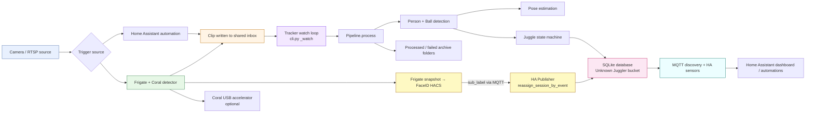

# Architecture

## Design driver: the hardware

The deployment target is a **2016 Intel MacBook Pro running Ubuntu**, already
running Home Assistant and Matter in Docker. Consequences:

- **No ML-usable GPU** (Intel integrated graphics, no CUDA) → PyTorch is
  **CPU-only**.
- Because it's an **Intel** CPU on Linux, **OpenVINO** (Intel's inference runtime)
  recovers a large chunk of speed — commonly ~2–3x over stock torch-CPU. Export
  once with `tools/export_openvino.py` and point config at the exported dirs.
- Even accelerated, the realtime pipeline (person-detect + pose + ball-track +
  face, every frame, fast enough to catch a ball mid-arc) is marginal on this
  CPU — **too slow to count juggles reliably in real time**, since a ball contact
  reverses in 2–3 frames.
- The box must stay responsive for HA/Matter, so the pipeline **caps CPU threads**
  (`processing.torch_threads`, default: leave 2 cores free) and the systemd unit
  runs at low CPU/IO priority.

## The batch (offline) decision

We **decouple capture from compute**:

```
                       full framerate (~25fps)              slower-than-realtime, accuracy preserved
  camera ──motion──▶ record short clip ──▶ inbox/ ──▶ batch worker ──▶ SQLite ──▶ MQTT ──▶ Home Assistant
```

### System diagram



The *source* clip is full framerate, so no fast ball contacts are lost — only the
*analysis* is slow, which is acceptable. Scores appear a few minutes after a
session rather than instantly. To stay **as close to real time as possible**:

- **nano** models (`yolo11n`, `yolo11n-pose`)
- frame **downscale** to `infer_long_edge` (default 960px long edge)
- **ROI crop** to the play area
- **person_stride**: run the expensive person-pose stage every Nth frame,
  but **always** detect the ball every frame (it's the fast object)
- ByteTrack interpolates person tracks between stride frames

## Frame pipeline

Per frame (`pipeline.Pipeline.process`):

1. **detect + track** — one YOLO call returns person boxes (COCO cls 0, tracked
   with ByteTrack → stable `track_id`) and the sports ball (cls 32; highest-conf
   detection is taken).
2. **pose** (every `person_stride` frames) — YOLO-pose gives 17 keypoints per
   person. Identity is **not** resolved per-frame (see below).
3. **attribute the ball** — in the one-kid-at-a-time case, the ball is assigned to
   the person nearest it; that person's keypoints are the active ones.
4. **juggle state machine** (`juggle.JuggleCounter`) — see below.
5. **persist + publish** — completed streaks go to SQLite attributed to
   **Unknown Juggler**. The HA publisher pushes per-person sensors and waits for
   FaceID to fire a re-attribution.

## Identity: FaceID async re-attribution

In-process InsightFace face recognition (per-frame embedding + cosine-similarity
voting) is **disabled**. Identity is now resolved asynchronously by the
[FaceID Community integration](https://github.com/SkyTechNerds/faceid)
running in Home Assistant.

```
clip processed → bucketed to Unknown Juggler → scores published
              ↓                                        ↓  (async, seconds later)
       Frigate snapshot → FaceID resolves name → MQTT sub_label published
              ↓
       juggle worker re-attributes Unknown attempts → scores republished
```

**Why this is better on this hardware:**

- InsightFace `buffalo_s` loads ~300 MB of ONNX model weights. On this
  constrained box (also running HA + Matter), that memory pressure
  noticeably affects responsiveness.
- FaceID runs inside HA's Docker container, which has its own memory budget
  and CPU scheduling.
- Accuracy is similar: InsightFace voted across many frames because any single
  frame was unreliable at yard distance. FaceID uses Frigate's best-frame
  snapshot with its own confidence score. For one-person-at-a-time sessions the
  single-snapshot approach is sufficient.

**How it works in code:**

- `pipeline.py` calls `db.start_session(..., frigate_event_id=...)` passing the
  event ID extracted from the clip filename (`clip_{camera}_{event_id}.mp4`).
- All completed streaks are written to `attempts` with `person_id = unknown_person_id`.
- `ha_mqtt.HAPublisher` subscribes to `frigate/+/person/+` (when
  `home_assistant.faceid_enabled: true`). On receipt it calls
  `db.reassign_session_by_event(event_id, person_name)` which moves all Unknown
  attempts for that session to the named person and recomputes high scores.
- `sync_all()` republishes the updated scores to HA immediately.

**Sub-label event routing (three cases):**

When `_on_faceid_event` receives a `sub_label` for `event_id` it tries
`reassign_session_by_event(event_id, person_name)` first. That call can return
a result (already processed) or `None` (nothing to move yet). The handler then
branches into one of three outcomes:

1. **Apply now** — `reassign_session_by_event` succeeds (session + Unknown
   attempts already committed). Scores are republished to HA immediately.
2. **Park as pending** — `reassign_session_by_event` returns `None` *and*
   `pipeline.is_event_queued(event_id)` is `True` (the clip is currently
   in-flight or sitting in the inbox). The `(event_id, person_name)` pair is
   stored in `HAPublisher._pending_faceid`.  
   At the end of `pipeline.process()`, after `db.finish_session()` commits all
   attempts, `ha.consume_pending_faceid(event_id)` pops the stored name and
   calls `reassign_session_by_event` — so scores are published under the correct
   person from the start with no Unknown Juggler intermediate state visible in HA.
3. **Drop** — `reassign_session_by_event` returns `None` *and* no clip for this
   event is queued or in-flight. The event_id is unknown, the clip was never
   received, or the session has no Unknown attempts remaining. The attribution is
   discarded so it never accumulates in `_pending_faceid`.

## Juggle state machine

Signal: the ball's **image-y** centroid over time. In image coordinates y grows
downward, so the bottom of each arc (ball meets foot/knee) is a **local maximum**
in y.

- A **contact** = smoothed vertical velocity flips descending(+) → ascending(−),
  with a minimum arc height (`min_arc_px`) since the last contact to reject jitter.
- At each contact, the **nearest confident body keypoint** to the ball is found:
  - foot/ankle/knee/shoulder/head (`valid_keypoints`, `_is_footish`) → **+1**
  - wrist/elbow (`illegal_keypoints`) → **reset** (reason `hand`)
  - keypoint too far (`> contact_radius_px`) → ambiguous, ignored
- A real floor contact is handled implicitly: the ball either goes missing for
  `lost_frames_reset` frames → streak ends (`lost`), or the ground bounce
  amplitude is too small to clear `min_arc_px` and won't pair with a valid
  keypoint.
- If the ball goes missing for `lost_frames_reset` frames → streak ends (`lost`).
- End of clip flushes any streak in progress (`end`).

Completed streaks become `attempts` rows; the max per person is the high score.

## Persistence

SQLite (`db.Database`): `people`, `sessions`, `attempts`. High
score is denormalized onto `people.high_score` for cheap HA reads and recomputed
transactionally on each recorded attempt.

## Home Assistant

`ha_mqtt.HAPublisher` uses **MQTT discovery** so a
`sensor.<person>_juggle_high_score` entity appears automatically per enrolled
person. A retained `last_session` topic carries the latest clip summary, and a
`new_high_score` event topic can drive TTS/notifications. See
[`HOME_ASSISTANT.md`](HOME_ASSISTANT.md).

## Known accuracy limits (the multi-week part)

- Motion blur on the ball at arc extremes (mitigated by full-framerate capture +
  low ball-conf threshold).
- Foot-vs-thigh contacts share few COCO keypoints (ankle/knee/hip only) — thigh
  contacts are approximated.
- FaceID re-attribution depends on Frigate's best-frame snapshot quality. If the
  kid never shows their face toward the camera during the event, FaceID won't fire
  and the session stays as Unknown Juggler. Use the HA reassign control to correct
  these manually.
- FaceID re-attribution is asynchronous and typically fires within seconds of
  Frigate recording a snapshot. The worker routes each sub_label event into one
  of three cases: (1) apply immediately if the session is already in the DB,
  (2) park as pending if the clip is still in-flight or queued and apply at the
  end of processing, or (3) drop if no matching clip is queued and no Unknown
  attempts exist (so stale events never accumulate).
- Two balls / two kids simultaneously is out of scope for v0.1 (one-at-a-time).
